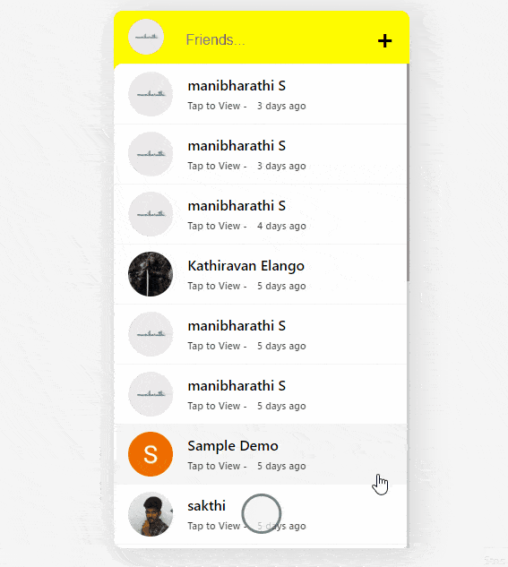
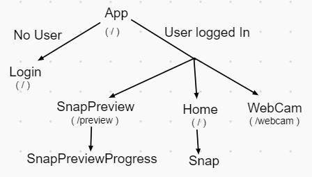

# SnapChat Clone
A Snapchat clone inspired from Sunny Sangha's Youtube video. I Changed the Design to my own liking and also made the website responsive.

#### Click [Here](https://snapchat-clone-ffea1.web.app/) to see the live Demo 

### Features 
* Upload Snaps directly by Taking photo from Camera
* Google Authentication for Sign In

### Technology Used
* **React** (FrontEnd)
    * **react-router-dom** - To manage routing between different pages(Login, Home, Webacm)
    * **react-webcam** - To capture photos from camera 
    * **react-timeago** - To give a realtime DateTime update for Snaps
    * **context-api** - To manage Global state across all Components
* **Firebase** - Baas (Backend as a Service)
    * **Firestore** - NoSQL database
    * **Authentication** - Google Authentication
    * **Storage** - Cloud Storage for uploading and saving Images

### Preview

### Components 
  * **App** - Main component which Hold all the other Components, this is where all the Routing has been done
  * **Login** - Login Page where user can login with their Google Account
  * **Home** - Home Page where User can view all Snaps. (**Route - '/'**)
  * **Snap** - This is the Reactangular Snap which is listed in the Home Componenet
  * **WebCam** - Webcam Page where Logged in User can capture photo and Upload. (**Route - '/webcam'**)
  * **SnapPreview** - This is the Preview of snap when User clicks the Snaps listed in the Home Component. (**Route - '/preview'**)
  * **SnapPreviewProgress** - This is the small Time Indication Bar present at the top of SnapPreview Component.
#### Component Tree

### To run this on Local machine
* Clone the repo, install all the dependcies from package.json
* Create a firebase project and replace all the Project keys in **'src/firebase.js'**
* Turn on Google Authentication in your firebase authentication console
* Run app by typing `npm start`in command line
